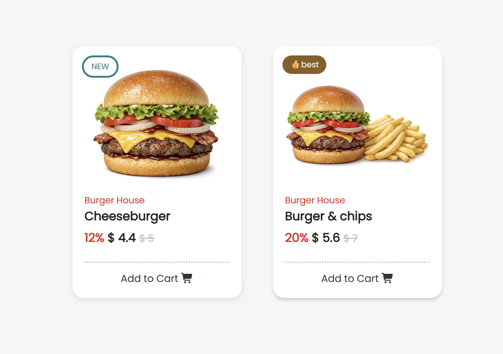

# card-UI-design

A collection of reusable and responsive card UI components built with HTML and CSS.

This repository was created to practice modern web design techniques and improve front-end development skills by recreating and designing various card layouts.

## Included Card Types

* Profile Cards
* Product Cards
* Food Cards
* Pricing Cards
* Blog Cards
* Service Cards
* And more coming soon...

## Goals

* Practice responsive web design
* Improve HTML and CSS skills
* Explore different layout techniques
* Build a reusable UI component collection
* Develop a stronger front-end portfolio

## Technologies Used

* HTML5
* CSS3
* Flexbox
* Grid Layout
* Responsive Design

## Future Plans

* Add animations and hover effects
* Implement JavaScript interactions
* Create dark mode versions
* Expand the component collection

Feel free to explore, learn from, or use these designs in your own projects.
 

Created as part of my front-end learning journey.
